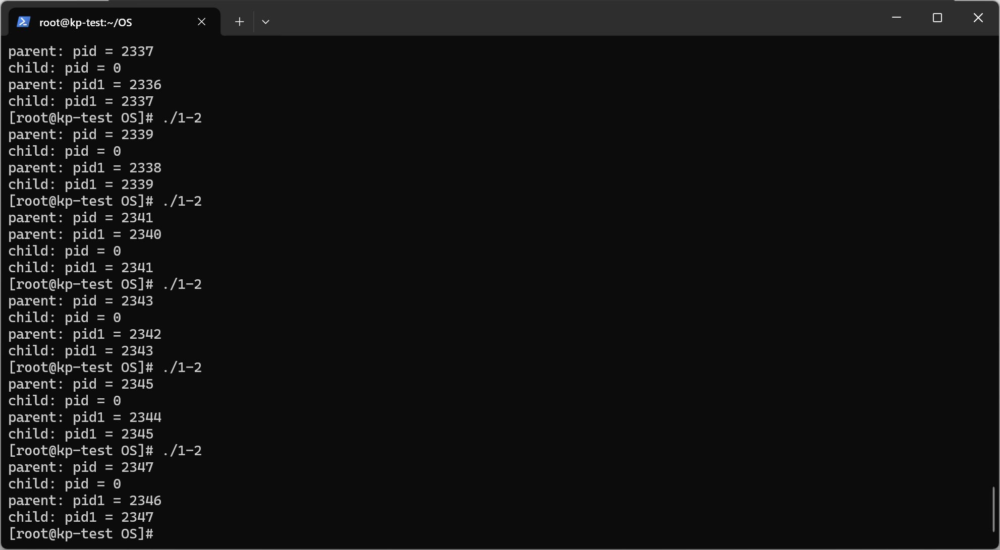
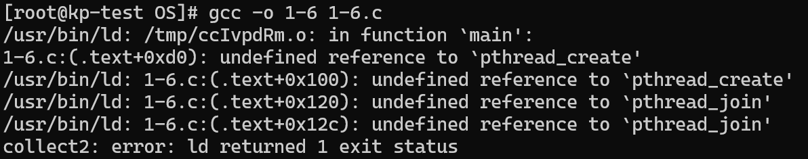

# OS1

## task 1 进程相关编程实验

### step 1

```C
#include <sys/types.h>
#include <stdio.h>
#include <unistd.h>

int main() {
    pid_t pid, pid1;
    // fork a child process
    pid = fork();
    if(pid < 0) { // error occurred
        fprintf(stderr, "Fork Failed");
        return 1;
    }
    else if(pid == 0) { // child process
        pid1 = getpid();
        printf("child: pid = %d\n", pid); // A
        printf("child: pid1 = %d\n", pid1); // B
    }
    else { // parent process
        pid1 = getpid();
        printf("parent: pid = %d\n", pid);
        printf("parent: pid1 = %d\n", pid1);
		sleep(20);
        wait(NULL);
    }
    return 0;
}
```

运行正常，结果符合预期。

​

通过在wait语句前加入sleep语句，在另一个终端中观测到僵尸进程。

​

20s后，僵尸进程被回收。

​

### step 2

```C
#include <sys/types.h>
#include <stdio.h>
#include <unistd.h>

int main() {
    pid_t pid, pid1;
    // fork a child process
    pid = fork();
    if(pid < 0) { // error occurred
        fprintf(stderr, "Fork Failed");
        return 1;
    }
    else if(pid == 0) { // child process
        pid1 = getpid();
        printf("child: pid = %d\n", pid); // A
        printf("child: pid1 = %d\n", pid1); // B
		sleep(5);
		printf("parent's pid = %d\n", getppid());
    }
    else { // parent process
        pid1 = getpid();
        printf("parent: pid = %d\n", pid);
        printf("parent: pid1 = %d\n", pid1);
        //wait(NULL);
    }
    return 0;
}
```

去除wait语句，运行正常，结果符合预期。

​

使用sleep语句和getppid语句，可以看到孤儿进程被pid = 1的进程领养。

​

### step 3

```C
#include <sys/types.h>
#include <stdio.h>
#include <unistd.h>

int val;

int main() {
    pid_t pid, pid1;
    // fork a child process
    pid = fork();
    if(pid < 0) { // error occurred
        fprintf(stderr, "Fork Failed");
        return 1;
    }
    else if(pid == 0) { // child process
        val = 1;
        pid1 = getpid();
        printf("child: val = %d\n", val); // A
        printf("child: *val = %d\n", &val); // B
    }
    else { // parent process
        val = -1;
        pid1 = getpid();
        printf("parent: val = %d\n", val);
        printf("parent: *val = %d\n", &val);
        wait(NULL);
    }
    return 0;
}
```

增加一个全局变量并在父子进程中对其进行不同的操作，此处的操作为父进程赋值为-1，子进程赋值为1。

​

按理这两个是不同进程中的变量，并且在两个进程中互相不受影响，即在一个进程中改变这个变量的值不会影响到另一个进程，而神奇的是这两个变量的地址相同。这是因为linux存在虚拟内存机制，每个进程都以为自己占用了全部内存，进程访问内存时，操作系统都会把进程提供的虚拟内存地址转换为物理地址，再去对应的物理地址上获取数据。（[参考链接](https://blog.csdn.net/weixin_45636061/article/details/124610215)）

### step 4

```C
#include <sys/types.h>
#include <stdio.h>
#include <unistd.h>

int val;

int main() {
    pid_t pid, pid1;
    // fork a child process
    pid = fork();
    if(pid < 0) { // error occurred
        fprintf(stderr, "Fork Failed");
        return 1;
    }
    else if(pid == 0) { // child process
        val = 1;
        pid1 = getpid();
        printf("child: val = %d\n", val); // A
        printf("child: *val = %d\n", &val); // B
    }
    else { // parent process
        val = -1;
        pid1 = getpid();
        printf("parent: val = %d\n", val);
        printf("parent: *val = %d\n", &val);
        wait(NULL);
    }
    val += 10;
    printf("bf rt val = %d\nbf rt *val = %d\n", val, &val);
    return 0;
}
```

在return前增加操作，对全局变量+10。

​

在对全局变量进行操作时，两个进程分别对自己的全局变量进行操作，互不影响。关于地址的解释同step 3。

### step 5

```c
#include <sys/types.h>
#include <stdio.h>
#include <unistd.h>

int main() {
    pid_t pid, pid1;
    // fork a child process
    pid = fork();
    if(pid < 0) { // error occurred
        fprintf(stderr, "Fork Failed");
        return 1;
    }
    else if(pid == 0) { // child process
        pid1 = getpid();
        printf("child process: PID: %d\n", pid1);

        // system()
        // printf("system(): ");
        system("./system_call");

        printf("child process: PID: %d\n", pid1);

        // exec
        // printf("exec: ");
        char *args[] = {"./system_call", NULL};
        execvp(args[0], args);

        printf("child process: PID: %d\n", pid1);
    }
    else { // parent process
        pid1 = getpid();
        printf("parent process PID %d\n", pid1);
        printf("child process PID %d\n", pid);
        wait(NULL);
    }
    return 0;
}
```

在子进程中先后执行system函数和exec族函数。

​

system函数执行后依然运行在子进程的上下文中，此时可以看作新建了一个进程用于运行system函数中的指令，故system_call得到的结果与子进程不同；exec族函数执行后会直接替代子进程的上下文，故system_call结果与子进程相同且exec族函数之后的语句不再执行。

## task 2 线程相关编程实验

### step 1

```c
#include <stdio.h>
#include <pthread.h>
#include <stdlib.h>

// 共享变量
int shared_var = 0;

// 线程1的操作函数：对共享变量加100，重复100,000次
void* increment(void* arg) {
    for (int i = 0; i < 100000; i++) {
        shared_var += 100;
    }
    return NULL;
}

// 线程2的操作函数：对共享变量减100，重复100,000次
void* decrement(void* arg) {
    for (int i = 0; i < 100000; i++) {
        shared_var -= 100;
    }
    return NULL;
}

int main() {
    // 创建两个线程
    pthread_t thread1, thread2;

    // 创建线程1，执行increment函数
    if(pthread_create(&thread1, NULL, increment, NULL) == 0)
        printf("thread1 create success!\n");

    // 创建线程2，执行decrement函数
    if(pthread_create(&thread2, NULL, decrement, NULL) == 0)
        printf("thread2 create success!\n");

    // 等待线程1结束
    pthread_join(thread1, NULL);

    // 等待线程2结束
    pthread_join(thread2, NULL);

    // 输出共享变量的最终值
    printf("Final value of shared variable: %d\n", shared_var);

    return 0;
}
```

共享变量为全局变量，初始化为0，创建两个线程分别对其进行10000次+100和-100操作。

​

在不进行互斥操作时，两个线程可能因为数据竞争等原因导致某一操作被覆盖，使得操作的对称性被破坏。

此外，在尝试编译时编译器报错：

​

查阅常见问题得知：

> pthread 库不是 Linux 系统默认的库，连接时需要使用静态库，编译时增加一个参数即可:gcc -o pro7 pro7.c -lpthread

增加参数后编译成功：

​

> linux小知识：没有消息就是好消息

### step 2

```c
#include <stdio.h>
#include <pthread.h>
#include <semaphore.h>
#include <stdlib.h>

// 共享变量
int shared_var = 0;

// 信号量
sem_t semaphore;

// 线程1的操作函数：对共享变量加100，重复100,000次
void* increment(void* arg) {
    for (int i = 0; i < 100000; i++) {
        sem_wait(&semaphore);  // 等待信号量（P操作）
        shared_var += 100;
        sem_post(&semaphore);  // 释放信号量（V操作）
    }
    return NULL;
}

// 线程2的操作函数：对共享变量减100，重复100,000次
void* decrement(void* arg) {
    for (int i = 0; i < 100000; i++) {
        sem_wait(&semaphore);  // 等待信号量（P操作）
        shared_var -= 100;
        sem_post(&semaphore);  // 释放信号量（V操作）
    }
    return NULL;
}

int main() {
    // 初始化信号量，初始值为1（表示资源可用）
    sem_init(&semaphore, 0, 1);

    // 创建两个线程
    pthread_t thread1, thread2;

    // 创建线程1，执行increment函数
    if(pthread_create(&thread1, NULL, increment, NULL) == 0)
        printf("thread1 create success!\n");

    // 创建线程2，执行decrement函数
    if(pthread_create(&thread2, NULL, decrement, NULL) == 0)
        printf("thread2 create success!\n");

    // 等待线程1结束
    pthread_join(thread1, NULL);

    // 等待线程2结束
    pthread_join(thread2, NULL);

    // 销毁信号量
    sem_destroy(&semaphore);

    // 输出共享变量的最终值
    printf("Final value of shared variable: %d\n", shared_var);

    return 0;
}
```

定义信号量，使用PV操作实现共享变量的访问与互斥。

​

加入互斥操作后，确保了两个线程不会同时对同一变量进行操作，从而保证了操作的对称性。

### step 3

#### part 1

在线程中调用system函数。

```c
#include <stdio.h>
#include <pthread.h>
#include <stdlib.h>
#include <sys/syscall.h>

// 共享变量
int shared_var = 0;

// 线程，使用system()
void* thread11(void* arg) {
    printf("thread1 tid = %d, pid = %d\n", syscall(SYS_gettid), getpid());
    system("./system_call");
    printf("thread1 system_call return\n");
    return NULL;
}

void* thread22(void* arg) {
    printf("thread2 tid = %d, pid = %d\n", syscall(SYS_gettid), getpid());
    system("./system_call");
    printf("thread2 system_call return\n");
    return NULL;
}

int main() {
    // 创建两个线程
    pthread_t thread1, thread2;

    // 创建线程1，执行increment函数
    if(pthread_create(&thread1, NULL, thread11, NULL) == 0)
        printf("thread1 create success!\n");

    // 创建线程2，执行decrement函数
    if(pthread_create(&thread2, NULL, thread22, NULL) == 0)
        printf("thread2 create success!\n");

    // 等待线程1结束
    pthread_join(thread1, NULL);

    // 等待线程2结束
    pthread_join(thread2, NULL);

    return 0;
}
```

​

system函数调用后依然在原进程的上下文中运行，故其执行后不会影响原进程，而其本身可看作在一个新进程中运行，故pid不同。

#### part 2

在线程中调用exec族函数。

```c
#include <stdio.h>
#include <pthread.h>
#include <stdlib.h>
#include <sys/syscall.h>

// 共享变量
int shared_var = 0;

// 线程，使用exec
void* thread11(void* arg) {
    printf("thread1 tid = %d, pid = %d\n", syscall(SYS_gettid), getpid());
    char *args[] = {"./system_call", NULL};
    execvp(args[0], args);
    printf("thread1 system_call return\n");
    return NULL;
}

void* thread22(void* arg) {
    printf("thread2 tid = %d, pid = %d\n", syscall(SYS_gettid), getpid());
    char *args[] = {"./system_call", NULL};
    execvp(args[0], args);
    printf("thread2 system_call return\n");
    return NULL;
}

int main() {
    // 创建两个线程
    pthread_t thread1, thread2;

    // 创建线程1，执行increment函数
    if(pthread_create(&thread1, NULL, thread11, NULL) == 0)
        printf("thread1 create success!\n");

    // 创建线程2，执行decrement函数
    if(pthread_create(&thread2, NULL, thread22, NULL) == 0)
        printf("thread2 create success!\n");

    // 等待线程1结束
    pthread_join(thread1, NULL);

    // 等待线程2结束
    pthread_join(thread2, NULL);

    return 0;
}
```

​

exec族函数调用后会替换原进程的上下文，故只要一个线程调用后就完全覆盖原进程，原进程包括它创建的线程都不再运行，故调用后得到的PID为原进程PID。

#### extra

注意到获取线程tid需要使用 `syscall(SYS_gettid)`​ 语句，要使用该语句需要添加 `#include <sys/syscall.h>`​ 。（[参考链接](https://www.cnblogs.com/lakeone/p/3789117.html)）

## task 3 自旋锁实验

依据提示补全代码。

```c
#include <stdio.h>
#include <pthread.h>

// 定义自旋锁结构体
typedef struct {
    int flag;
} spinlock_t;

// 初始化自旋锁
void spinlock_init(spinlock_t *lock) {
    lock->flag = 0;
}

// 获取自旋锁
void spinlock_lock(spinlock_t *lock) {
    while (__sync_lock_test_and_set(&lock->flag, 1)) {
        // 自旋等待
    }
}

// 释放自旋锁
void spinlock_unlock(spinlock_t *lock) {
    __sync_lock_release(&lock->flag);
}

// 共享变量
int shared_value = 0;

// 线程函数
void *thread_function(void *arg) {
    spinlock_t *lock = (spinlock_t *)arg;
    for (int i = 0; i < 5000; ++i) {
        spinlock_lock(lock);
        shared_value+=2;
        spinlock_unlock(lock);
    }
    return NULL;
}

int main() {
    pthread_t thread1, thread2;
    spinlock_t lock;

    // 输出共享变量的初始值
    printf("Shared value: %d\n", shared_value);

    // 初始化自旋锁
    spinlock_init(&lock);

    // 创建两个线程
    if(pthread_create(&thread1, NULL, thread_function, &lock) == 0)
        printf("thread1 create success!\n");
    if(pthread_create(&thread2, NULL, thread_function, &lock) == 0)
        printf("thread2 create success!\n");

    // 等待线程结束
    pthread_join(thread1, NULL);
    pthread_join(thread2, NULL);

    // 输出共享变量的最终值
    printf("Shared value: %d\n", shared_value);

    return 0;
}
```

线程操作为对共享变量+2，执行5000次，共2个线程。

​

自旋锁是一种基于忙等待（busy-waiting）的同步机制，用于在线程竞争共享资源时，不断尝试获取锁，而不是阻塞等待。这种方式在锁的占用时间很短的情况下可以减少线程切换的开销，提高程序性能。
