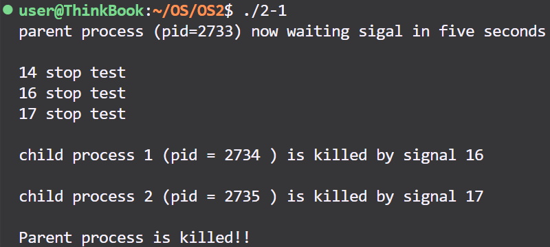

# OS2

## task 1 进程的软中断通信

```c
#include <stdio.h>
#include <unistd.h>
#include <sys/wait.h>
#include <stdlib.h>
#include <signal.h>

pid_t pid1 = -1, pid2 = -1;

void parent_handler(int sig) {
    printf("\n%d stop test\n", sig);
    printf("16 stop test\n");
    while(kill(pid1, 16) < 0); //循环执行直到信号正确发出
    printf("17 stop test\n");
    while(kill(pid2, 17) < 0); //循环执行直到信号正确发出
}

void child_handler(int sig) {
    if(sig == 16) {
        printf("\nchild process 1 (pid = %d ) is killed by signal %d\n", getpid (), sig);
    }
    if(sig == 17) {
        printf("\nchild process 2 (pid = %d ) is killed by signal %d\n", getpid (), sig);
    }
    exit(0);
}

int main() {

    while (pid1 == -1) pid1 = fork(); //尝试创建子进程 1
    if (pid1 > 0) {
        while (pid2 == -1) pid2 = fork(); //尝试创建子进程 2
        if (pid2 > 0) {
            // TODO: 父进程
            printf("parent process (pid=%d) now waiting sigal in five seconds\n", getpid ());
            signal(SIGINT, parent_handler);
            signal(SIGQUIT, parent_handler);
            signal(SIGALRM, parent_handler);
            alarm(5); //5秒后发出SIGALRM信号
            wait(NULL);
            wait(NULL);
            printf("\nParent process is killed!!\n");
        }
        else {
            // TODO: 子进程 2
            signal(SIGINT, SIG_IGN);
            signal(SIGQUIT, SIG_IGN);
            signal(17, child_handler);
            pause(); //阻塞住子进程
        }
    }
    else {
        // TODO: 子进程 1
        signal(SIGINT, SIG_IGN);
        signal(SIGQUIT, SIG_IGN);
        signal(16, child_handler);
        pause(); //阻塞住子进程
    }

    return 0;
}
```

​​

​​

​​

1. 你最初认为运行结果会怎么样？写出你猜测的结果。

    父进程收到信号后，两个子进程被杀死，父进程退出。
2. 实际的结果什么样？有什么特点？在接收不同中断前后有什么差别？请将5秒内中断和5秒后中断的运行结果截图，试对产生该现象的原因进行分析。

    父进程收到信号后，两个子进程被杀死，杀死的顺序不固定。在5秒内中断，进程将收到SIG_INT信号或者SIG_QUIT信号；在5秒后中断，进程将收到SIG_ALRM信号。信号种类不同。
3. 改为闹钟中断后，程序运行的结果是什么样子？与之前有什么不同？

    进程收到SIG_ALRM信号，执行相应操作。alarm()是非阻塞操作，不会将程序挂起影响后续执行。
4. kill命令在程序中使用了几次？每次的作用是什么？执行后的现象是什么？

    使用两次，分别从外部杀死两个子进程，执行后可以看到两个子进程收到信号终止。
5. 使用kill命令可以在进程的外部杀死进程。进程怎样能主动退出？这两种退出方式哪种更好一些？

    进程执行exit()操作即可主动退出。

    进程主动退出更好。

## task 2 进程的管道通信

```c
#include <unistd.h>
#include <signal.h>
#include <stdio.h>
#include <stdlib.h>
#include <sys/wait.h>

int pid1, pid2; // 定义两个进程变量

int main() {
    int fd[2];
    char InPipe[1000]; // 定义读缓冲区
    char c1='1', c2='2';
    pipe(fd); // 创建管道

    while((pid1 = fork()) == -1); // 如果进程1创建不成功,则空循环
    if(pid1 == 0) { // 如果子进程1创建成功,pid1为进程号
        // 子进程 1
        lockf(fd[1], 1, 0); // 锁定管道

        // 分2000次每次向管道写入字符'1'
        for (int i = 0; i < 2000; i++) {
            write(fd[1], &c1, 1); // 向管道写入字符'1'
        }

        sleep(5); // 等待读进程读出数据
        lockf(fd[1], 0, 0); // 解除管道的锁定
        exit(0); // 结束进程1
    }  
    else {
        while((pid2 = fork()) == -1); // 若进程2创建不成功,则空循环
        if(pid2 == 0) {
            // 子进程 2
            lockf(fd[1], 1, 0);
          
            // 分2000次每次向管道写入字符'2'
            for (int i = 0; i < 2000; i++) {
                write(fd[1], &c2, 1); // 向管道写入字符'2'
            }

            sleep(5);
            lockf(fd[1], 0, 0); // 解除管道的锁定
            exit(0);
        }
        else {
            //父进程
            wait(NULL); // 等待子进程1 结束
            wait(NULL); // 等待子进程2 结束
            read(fd[0], InPipe, 4000); // 从管道中读出4000个字符
            InPipe[4000] = '\0'; // 加字符串结束符
            printf("%s\n",InPipe); // 显示读出的数据
            exit(0); // 父进程结束
        }
    }
    return 0;
}
```

​​

​​

1. 你最初认为运行结果会怎么样？

    有锁状态下，输出1000个1；无锁状态下，交替输出1和2共1000个。
2. 实际的结果什么样？有什么特点？试对产生该现象的原因进行分析。

    有锁状态下，先后输出2000个1和2000个2，总的输出字符数远大于读缓冲区定义的1000个字符。因为当进程锁定管道后其他进程无法对管道进行操作，而操作系统会根据实际情况采用分段读取、缓冲区溢出管理等机制以有效地处理大于缓冲区大小的输入数据。

    无锁状态下，先输出一部分连续的1，然后大体上1和2交替输出，偶然出现1或2连续输出的情况，最后输出连续的2。因为子进程1先启动，一段时间后子进程2才启动，而两个进程的运行不严格同步，故1和2不严格交替输出。
3. 实验中管道通信是怎样实现同步与互斥的？如果不控制同步与互斥会发生什么后果？

    利用对管道的锁定与解锁即可实现管道通信的同步与互斥。

    写入管道的数据将变得混乱，不符合预期。

## task 3 内存的分配与回收

```c
#include <stdio.h>
#include <stdlib.h>

#define PROCESS_NAME_LEN 32 //进程名长度
#define MIN_SLICE 10 //最小碎片的大小
#define DEFAULT_MEM_SIZE 1024 //内存大小
#define DEFAULT_MEM_START 0 //起始位置
/*内存分配算法*/
#define MA_FF 1
#define MA_BF 2
#define MA_WF 3
int mem_size = DEFAULT_MEM_SIZE; //内存大小
int ma_algorithm = MA_FF; //当前分配算法
static int pid = 0; //初始pid
int flag = 0; //设置内存大小标志

/*描述每一个空闲块的数据结构*/
struct free_block_type {
    int size;
    int start_addr;
    struct free_block_type *next;
};
/*指向内存中空闲块链表的首指针*/
struct free_block_type *free_block;

/*每个进程分配到的内存块的描述*/
struct allocated_block{
    int pid;
    int size;
    int start_addr;
    char process_name[PROCESS_NAME_LEN];
    struct allocated_block *next;
};
/*进程分配内存块链表的首指针*/
struct allocated_block *allocated_block_head = NULL;

/*初始化空闲块，默认为一块，可以指定大小及起始地址*/ 
struct free_block_type* init_free_block(int mem_size){ 
    struct free_block_type *fb; 
    fb = (struct free_block_type *)malloc(sizeof(struct free_block_type)); 
    if(fb == NULL) { 
        printf("No mem\n"); 
        return NULL; 
    } 
    fb->size = mem_size; 
    fb->start_addr = DEFAULT_MEM_START; 
    fb->next = NULL; 
    return fb; 
} 

/*显示菜单*/ 
void display_menu() { 
    printf("\n"); 
    printf("1 - Set memory size (default=%d)\n", DEFAULT_MEM_SIZE); 
    printf("2 - Select memory allocation algorithm\n"); 
    printf("3 - New process \n"); 
    printf("4 - Terminate a process \n"); 
    printf("5 - Display memory usage \n"); 
    printf("0 - Exit\n"); 
} 

/*设置内存的大小*/ 
int set_mem_size() { 
    int size; 
    if(flag != 0) {  //防止重复设置 
        printf("Cannot set memory size again\n"); 
        return 0; 
    } 
    printf("Total memory size ="); 
    scanf("%d", &size); 
    if(size > 0) { 
        mem_size = size; 
        free_block->size = mem_size; 
    } 
    flag = 1;
    return 1; 
}

/*按FF算法重新整理内存空闲块链表*/
void rearrange_FF() {
    struct free_block_type *head = free_block;
    int free_block_count = 0; //计算节点数
    while(head != NULL) {
        free_block_count++;
        head = head->next;
    }
    // 冒泡排序
    for(int i = 0; i < free_block_count - 1; i++) {
        struct free_block_type *node = free_block;
        struct free_block_type *pre = free_block;
        for(int j = 0; j < free_block_count - 1 - i; j++) {
            if(node->start_addr > node->next->start_addr) { //如果前驱节点地址大于后续节点
                if(j == 0) {
                    free_block = node->next; //如果是前两个交换，注意更换free_block的指向
                    struct free_block_type *temp = node->next;
                    node->next = temp->next;
                    temp->next = node;
                } else {
                    struct free_block_type *temp = node->next;
                    pre->next = temp;
                    node->next = temp->next;
                    temp->next = node;
                }
            } else {
                pre = node;
                node = node->next;
            }
        }
    }
}
/*按BF算法重新整理内存空闲块链表*/
void rearrange_BF() {
    struct free_block_type *head = free_block;
    int free_block_count = 0; //计算节点数
    while(head != NULL) {
        free_block_count++;
        head = head->next;
    }
    // 冒泡排序
    for(int i = 0; i < free_block_count - 1; i++) {
        struct free_block_type *node = free_block;
        struct free_block_type *pre = free_block;
        for(int j = 0; j < free_block_count - 1 - i; j++) {
            if(node->size > node->next->size) { //如果前驱节点size大于后续节点
                if(j == 0) {
                    free_block = node->next; //如果是前两个交换，注意更换free_block的指向
                    struct free_block_type *temp = node->next;
                    node->next = temp->next;
                    temp->next = node;
                } else {
                    struct free_block_type *temp = node->next;
                    pre->next = temp;
                    node->next = temp->next;
                    temp->next = node;
                }
            } else {
                pre = node;
                node = node->next;
            }
        }
    }
}
/*按WF算法重新整理内存空闲块链表*/
void rearrange_WF() {
    struct free_block_type *head = free_block;
    int free_block_count = 0; //计算节点数
    while(head != NULL) {
        free_block_count++;
        head = head->next;
    }
    // 冒泡排序
    for(int i = 0; i < free_block_count - 1; i++) {
        struct free_block_type *node = free_block;
        struct free_block_type *pre = free_block;
        for(int j = 0; j < free_block_count - 1 - i; j++) {
            if(node->size < node->next->size) { //如果前驱节点size小于后续节点
                if(j == 0) {
                    free_block = node->next; //如果是前两个交换，注意更换free_block的指向
                    struct free_block_type *temp = node->next;
                    node->next = temp->next;
                    temp->next = node;
                } else {
                    struct free_block_type *temp = node->next;
                    pre->next = temp;
                    node->next = temp->next;
                    temp->next = node;
                }
            } else {
                pre = node;
                node = node->next;
            }
        }
    }
}

/*按指定的算法整理内存空闲块链表*/ 
void rearrange(int algorithm) { 
    switch(algorithm) { 
        case MA_FF: rearrange_FF(); break; 
        case MA_BF: rearrange_BF(); break; 
        case MA_WF: rearrange_WF(); break; 
    } 
} 

/*设置当前的分配算法*/ 
void set_algorithm() { 
    int algorithm; 
    printf("\t1 - First Fit\n"); 
    printf("\t2 - Best Fit\n"); 
    printf("\t3 - Worst Fit\n"); 
    scanf("%d", &algorithm); 
    if(algorithm >= 1 && algorithm <= 3) 
        ma_algorithm = algorithm; 
    //按指定算法重新排列空闲区链表 
    rearrange(ma_algorithm); 
} 

/*内存紧缩操作*/
void compact_memory(int sliceSize) { //参数为所有空闲内存大小
    struct allocated_block *ab = allocated_block_head;
    free_block->start_addr = 0;
    free_block->size = sliceSize;
    free_block->next = NULL; //紧缩原则是空闲内存从地址0开始
    while(ab != NULL) {
        ab->start_addr = sliceSize;
        sliceSize += ab->size;
        ab = ab->next;
    }
}

/*分配内存模块*/ 
int allocate_mem(struct allocated_block *ab) { 
    struct free_block_type *fbt, *pre; 
    int request_size = ab->size; 
    fbt = pre = free_block; 

    //根据当前算法在空闲分区链表中搜索合适空闲分区进行分配，分配时注意以下情况： 
    // 1. 找到可满足空闲分区且分配后剩余空间足够大，则分割 
    // 2. 找到可满足空闲分区且但分配后剩余空间比较小，则一起分配 
    // 3. 找不到可满足需要的空闲分区但空闲分区之和能满足需要，则采用内存紧缩技术，进行空闲分区的合并，然后再分配 
    // 4. 在成功分配内存后，应保持空闲分区按照相应算法有序 
    // 5. 分配成功则返回1，否则返回-1 
  
    // 根据当前算法在空闲分区链表中搜索合适空闲分区进行分配
    while (fbt != NULL) {
        // 检查当前空闲分区大小是否满足请求的内存大小
        if (fbt->size >= request_size) {
            // 分配内存给请求的进程
            ab->start_addr = fbt->start_addr;
            // 分割空闲分区，如果分配后剩余空间足够大
            if (fbt->size - request_size >= MIN_SLICE) {
                fbt->start_addr += request_size;
                fbt->size -= request_size;
            } else { // 一起分配
                // 如果剩余空间不够大，全部分配
                if (free_block == fbt) {
                    free_block = fbt->next;
                } else {
                    pre->next = fbt->next;
                }
                ab->size = fbt->size;
                free(fbt);
            }
            return 1; // 分配成功
        }
        pre = fbt;
        fbt = fbt->next;
    }

    // 如果找不到单个满足请求的空闲分区
    // 检查空闲分区之和是否能满足请求
    int total_free = 0;
    fbt = free_block;
    while (fbt != NULL) {
        total_free += fbt->size;
        fbt = fbt->next;
    }

    // 如果空闲分区之和满足请求
    if (total_free >= request_size) {
        compact_memory(total_free);  // 采用内存紧缩技术，进行空闲分区的合并
        return allocate_mem(ab);  // 再次尝试分配内存
    }

    return -1; // 分配失败
} 

/*创建新的进程，主要是获取内存的申请数量*/ 
int new_process() { 
    struct allocated_block *ab; 
    int size;
    int ret; 
    ab = (struct allocated_block *)malloc(sizeof(struct allocated_block)); 
    if(!ab) exit(-5); 
    ab->next = NULL; 
    pid++; 
    sprintf(ab->process_name, "PROCESS-%02d", pid); 
    ab->pid = pid;   
    printf("Memory for %s:", ab->process_name); 
    scanf("%d", &size); 
    if(size>0) ab->size=size; 
    ret = allocate_mem(ab);  /*从空闲区分配内存，ret==1表示分配ok*/ 
    /*如果此时allocated_block_head尚未赋值，则赋值*/ 
    if((ret == 1) && (allocated_block_head == NULL)) {  
        allocated_block_head = ab; 
        return 1;
    } 
    /*分配成功，将该已分配块的描述插入已分配链表*/ 
    else if (ret == 1) { 
        ab->next = allocated_block_head; 
        allocated_block_head = ab; 
        return 2;
    } 
    else if(ret == -1) { /*分配不成功*/ 
        printf("Allocation fail\n"); 
        free(ab); 
        return -1;      
    } 
    return 3; 
} 

/*释放ab数据结构节点*/ 
int dispose(struct allocated_block *free_ab) { 
    struct allocated_block *pre, *ab; 
    if(free_ab == allocated_block_head) { /*如果要释放第一个节点*/ 
        allocated_block_head = allocated_block_head->next; 
        free(free_ab); 
        return 1; 
    } 
    pre = allocated_block_head;   
    ab = allocated_block_head->next; 
    while(ab != free_ab) { pre = ab;  ab = ab->next; } 
    pre->next = ab->next; 
    free(ab); 
    return 2; 
} 

/*将ab所表示的已分配区归还，并进行可能的合并*/ 
int free_mem(struct allocated_block *ab){ 
    int algorithm = ma_algorithm; 
    struct free_block_type *fbt, *pre, *work; 
    fbt = (struct free_block_type*) malloc(sizeof(struct free_block_type)); 
    if(!fbt) return -1; 

    // 进行可能的合并，基本策略如下 
    // 1. 将新释放的结点插入到空闲分区队列末尾 
    // 2. 对空闲链表按照地址有序排列 
    // 3. 检查并合并相邻的空闲分区 
    // 4. 将空闲链表重新按照当前算法排序 

    pre = free_block;
    fbt->start_addr = ab->start_addr;
    fbt->size = ab->size;
    fbt->next = NULL;

    // 将新释放的结点插入到空闲分区队列末尾
    if (free_block == NULL) {
        free_block = fbt;
    } else {
        while (pre->next != NULL) {
            pre = pre->next;
        }
        pre->next = fbt;
    }

    // 对空闲链表按照地址有序排列
    rearrange(MA_FF);

    // 检查并合并相邻的空闲分区
    pre = free_block;
    fbt = pre->next;
    while (fbt != NULL) {
        if (pre->start_addr + pre->size == fbt->start_addr) {
            // 合并相邻的空闲分区
            pre->size += fbt->size;
            pre->next = fbt->next;
            free(fbt);
            fbt = pre->next;
        } else if (pre->start_addr > fbt->start_addr) {
            // 如果前一个空闲分区的起始地址比后一个的还大，交换顺序
            // 实现逻辑：如果fbt的起始地址比pre小，则交换它们的位置
            work = fbt->next;
            fbt->next = free_block;
            free_block = fbt;

            pre->next = work;
            pre = free_block;
            fbt = fbt->next;
        } else {
            pre = fbt;
            fbt = fbt->next;
        }
    }

    // 将空闲链表重新按照当前算法排序
    rearrange(algorithm);
  
    return 1;
} 

struct allocated_block *find_process(int pid) {
    struct allocated_block *current = allocated_block_head;
    while(current != NULL) {
        if(current->pid == pid) return current;
        current = current->next;
    }
    return NULL;
}

/*删除进程，归还分配的存储空间，并删除描述该进程内存分配的节点*/ 
void kill_process() { 
    struct allocated_block *ab; 
    int pid; 
    printf("Kill Process, pid="); 
    scanf("%d", &pid); 
    ab = find_process(pid); 
    if(ab != NULL) { 
        free_mem(ab); /*释放ab所表示的分配区*/ 
        dispose(ab); /*释放ab数据结构节点*/ 
    } 
} 

/* 显示当前内存的使用情况，包括空闲区的情况和已经分配的情况 */ 
int display_mem_usage() { 
    struct free_block_type *fbt = free_block; 
    struct allocated_block *ab = allocated_block_head; 
    if(fbt == NULL) return(-1); 
    printf("----------------------------------------------------------\n"); 
    /* 显示空闲区 */ 
    printf("Free Memory:\n"); 
    printf("%20s %20s\n", "start_addr", "size"); 
    while(fbt!=NULL) { 
        printf("%20d %20d\n", fbt->start_addr, fbt->size); 
        fbt = fbt->next; 
    }   
    /* 显示已分配区 */ 
    printf("\nUsed Memory:\n"); 
    printf("%10s %20s %10s %10s\n", "PID", "ProcessName", "start_addr", " size"); 
    while(ab!=NULL) { 
        printf("%10d %20s %10d %10d\n", ab->pid, ab->process_name, ab->start_addr, ab->size); 
        ab = ab->next; 
    } 
    printf("----------------------------------------------------------\n"); 
    return 0;
}

void do_exit() {
    struct allocated_block *current = allocated_block_head, *next;
    while(current != NULL) {
        next = current->next;
        free(current);
        current = next;
    }
}

int main() {
    char choice;
    pid=0;
    free_block = init_free_block(mem_size); //初始化空闲区
    while(1) {
        display_menu(); //显示菜单
        fflush(stdin);
        scanf(" %c", &choice); //获取用户输入
        // system("clear");
        switch(choice) {
            case '1': set_mem_size(); break; //设置内存大小
            case '2': set_algorithm(); flag = 1; break; //设置算法
            case '3': new_process(); flag = 1; display_mem_usage(); break; //创建新进程
            case '4': kill_process(); flag = 1; display_mem_usage(); break; //删除进程
            case '5': display_mem_usage(); flag = 1; break; //显示内存使用
            case '0': do_exit(); exit(0); //释放链表并退出
            default: break;
        }
    }
}
```

​​

​​

​​

​​

​​

​​

​​

​​

​​

1. 对涉及的3个算法进行比较，包括算法思想、算法的优缺点、在实现上如何提高算法的查找性能。

    **首次适应算法（First Fit）** ：该算法从空闲分区链首开始查找，直至找到一个能满足其大小要求的空闲分区为止。然后再按照作业的大小，从该分区中划出一块内存分配给请求者，余下的空闲分区仍留在空闲分区链中。

    优点： 该算法倾向于使用内存中低地址部分的空闲区，在高地址部分的空闲区很少被利用，从而保留了高地址部分的大空闲区。显然为以后到达的大作业分配大的内存空间创造了条件。

    缺点：低地址部分不断被划分，留下许多难以利用、很小的空闲区，而每次查找又都从低地址部分开始，会增加查找的开销。  

    **最佳适应算法（Best Fit）** ：该算法总是把既能满足要求，又是最小的空闲分区分配给作业。为了加速查找，该算法要求将所有的空闲区按其大小排序后，以递增顺序形成一个空白链。

    优点：每次分配给文件的都是最合适该文件大小的分区，使得每次分配后剩余的空间一定是最小的。

    缺点：内存中留下许多难以利用的小的空闲区。

    **最坏适应算法（Worst Fit）** ：该算法按大小递减的顺序形成空闲区链，分配时直接从空闲区链的第一个空闲区中分配（不能满足需要则不分配）。

    优点：给文件分配分区后剩下的空闲区不至于太小，产生碎片的几率最小，对中小型文件分配分区操作有利。

    缺点：使存储器中缺乏大的空闲区，对大型文件的分区分配不利。
2. 3种算法的空闲块排序分别是如何实现的。

    对链表按照策略分别进行冒泡排序。
3. 结合实验，举例说明什么是内碎片、外碎片，紧缩功能解决的是什么碎片。

    内碎片：所有的内存分配必须起始于可被 4、8 或 16 整除（视处理器体系结构而定）的地址或者因为MMU的分页机制的限制，决定内存分配算法仅能把预定大小的内存块分配给客户。假设当某个客户请求一个43字节的内存块时，因为没有适合大小的内存，所以它可能会获得44字节、48字节等稍大一点的字节，因此由所需大小四舍五入而产生的多余空间就叫内部碎片。

    外碎片：频繁的分配与回收物理页面会导致大量的、连续且小的页面块夹杂在已分配的页面中间，就会产生外部碎片。

    紧缩功能解决的是外碎片。
4. 在回收内存时，空闲块合并是如何实现的？

    将剩余内存链表按照地址顺序排列，如果某一空闲内存块的起始地址与空间之和等于下一空闲内存块的起始地址，说明这两个空闲内存块相邻，故可合并。
