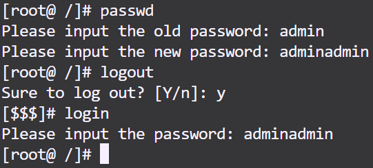
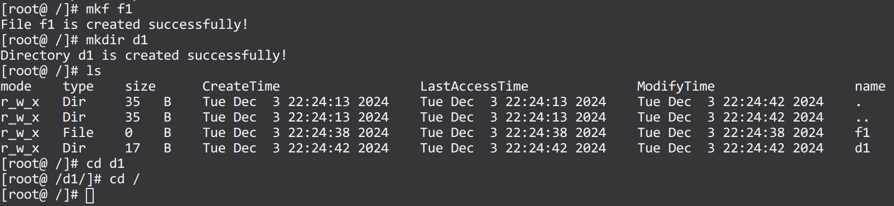
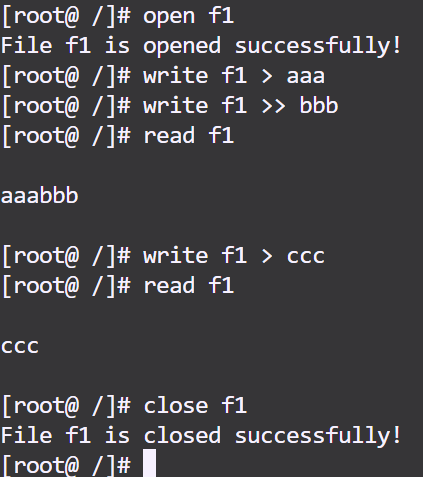
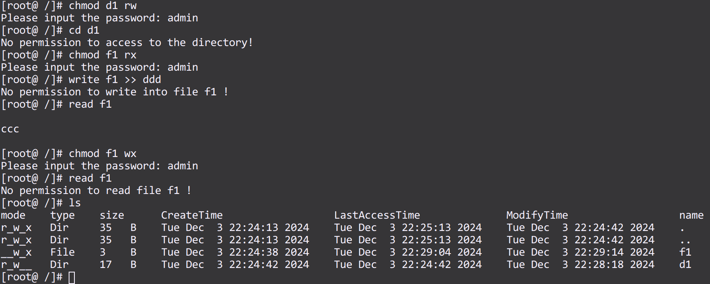
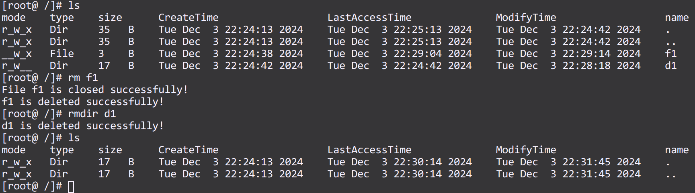
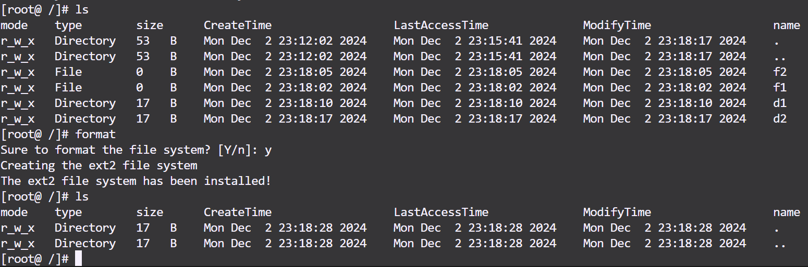

# OS3

## 命令实现

### password · logout · login

> 1183

​​

### creat · ls · cd

> 716 · 589 · 652

​​

### open · write · read · close

> 930 · 1019 · 981 · 956

​​

### chmod

> 1117

​​

### delete

> 875

​​

### format

> 1162

​​

## 问题与解决办法

### 1.文件系统结构繁杂，无法确定结构体中应包含哪些数据

这是对文件系统不熟悉导致的，查找资料弄清ext2文件系统的数据结构后，参考其组成即可。

### 2.每次调用函数对模拟文件进行读写操作均会清空文件

使用fopen()打开文件时均使用wb+参数，导致文件被打开时即被清空，通过查询资料为不同的操作设置正确的权限。

[C 库函数 – fopen() | 菜鸟教程](https://www.runoob.com/cprogramming/c-function-fopen.html)

### 3.在使用ls输出文件的三个时间始终相同

注意到最后输出的时间始终是最后一次调用localtime()函数对应的时间，查询资料得知该函数采用的是一块固定的buffer，多次调用时后取的数据会覆盖前取的数据，因此应该在每次调用localtime()函数时立即把buffer内容拷贝出来。

[localtime 2次连续调用问题_c localtime 两次调用-CSDN博客](https://blog.csdn.net/helloarm123456/article/details/40181375)
